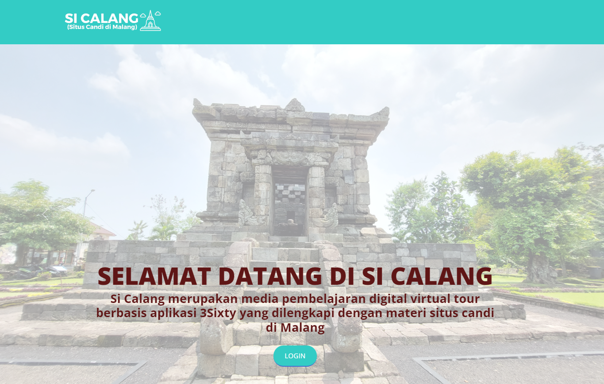
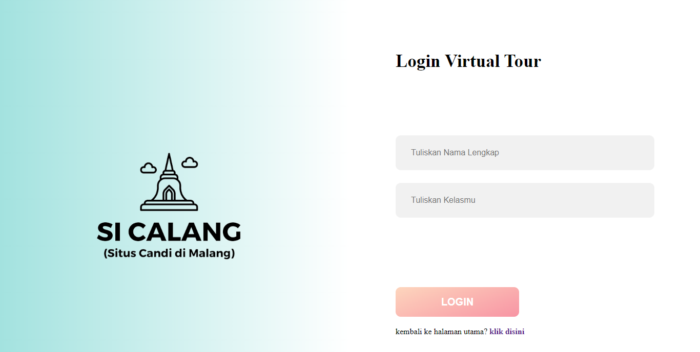
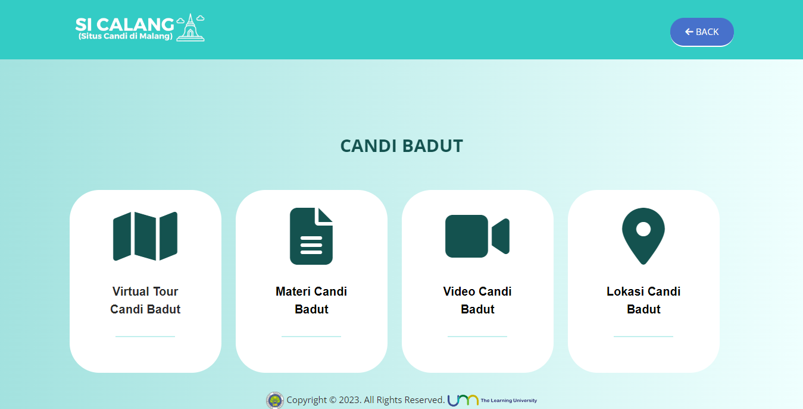
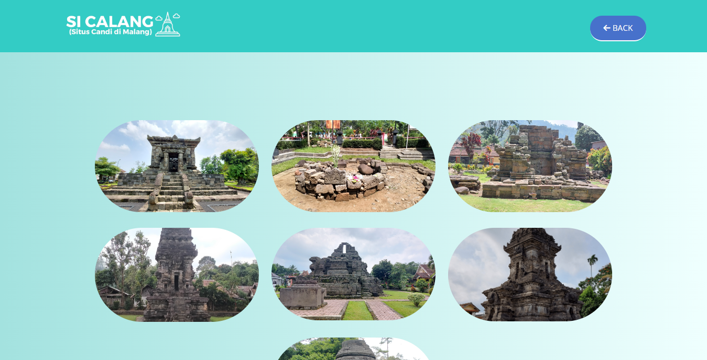
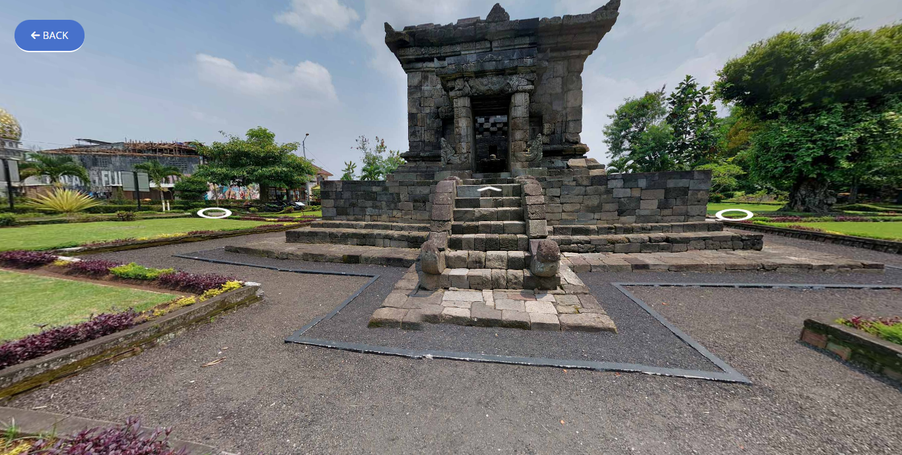
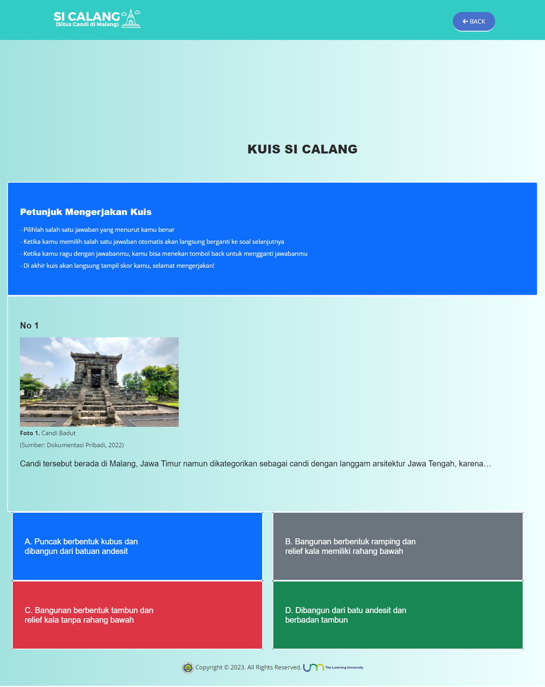

# Website SICALANG(SITUS CANDI DI MALANG)

Website SICALANG(SITUS CANDI DI MALANG) merupakan media pembelajaran digital virtual tour berbasis aplikasi 3Sixty yang dilengkapi dengan materi situs candi di Malang

Proyek ini dibangun dengan menggunakan Laravel, Boostrap, dan 3sixty untuk membuat virtual tournya.
## Teknologi Yang Digunakan 

Framework : Laravel, Boostrap

Virtual Tour : 3Sixty Web Tour Maker

## Screenshot














## Prasyarat

Pastikan Anda telah menginstal [Laravel](https://laravel.com/) dan [Composer](https://getcomposer.org/) di sistem Anda sebelum menjalankan proyek ini.


## Instalasi

1. Clone repositori ini:

   ```bash
   git clone https://github.com/AdeMariaUlfa/sicalang.git
   ```
   
2. Masuk ke direktori proyek:

   ```bash
   cd sicalang
   ```

3. Salin file .env.example menjadi .env dan sesuaikan pengaturan database:

   ```bash
   cp .env.example .env
   ```

4. Jalankan perintah berikut untuk menginstal dependensi:

   ```bash
   composer install
   ```


5. Generate key aplikasi Laravel:

   ```bash
   php artisan key:generate
   ```

6. Jalankan server pengembangan Laravel

   ```bash
   php artisan serve
   ```
